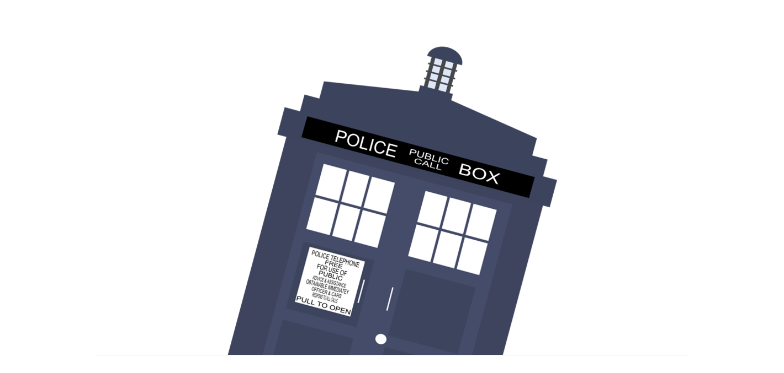

<p align="center">
    
    <h1 align="center">Doctor Who companions</h1>
</p>

<p align="center">
    <a href="https://www.npmjs.com/package/doctor-who"></a>
    <a href="https://travis-ci.com/CorentinTh/doctor-who"></a>
    <a href='https://coveralls.io/github/CorentinTh/doctor-who?branch=master'></a>
    <a href="https://www.npmjs.com/package/doctor-who"></a>
    <a href="https://www.npmjs.com/package/doctor-who"></a>
    <a href='LICENCE'></a>
</p>

Doctor Who names: a simple and small npm package to get Doctor Who characters names. Can be useful for data anonymization or username placeholder.


```javascript
const Generator = require('doctor-who');
const gen = new Generator();

gen.random(); // 'Rory Williams'
gen.all(); // ['Amy Pond', 'Rose Tyler', ... ]
gen.get(2); // ['River Song', 'Clara Oswald']
```

## Installation

Use `yarn` or `npm` to install this package:

```shell
npm install --global doctor-who
# or
yarn global add doctor-who
```


## API

### constructor(doctors = 'all', language = 'en')

Create a new generator instance. You could choose the language in parameter and which Doctor companions to choose.

```javascript
const Generator = require('doctor-who');

const gen = new Generator();
// Same as:
const gen = new Generator('all', 'en');
```

```javascript
const Generator = require('doctor-who');

// Will generate names from only the companions of the 10th and 11th Doctor.
const gen = new Generator([11, 10]);

// Will generate names from the companions of all Doctors.
const gen = new Generator('all');

// Will generate names from the companions of only the 12th doctor.
const gen = new Generator([12]);
```

### random()

Return a random name of a character in Doctor Who.

```javascript
const Generator = require('doctor-who');
const gen = new Generator();

gen.random(); // Amy Pond
```

### all()

Return an array containing all names.

```javascript
const Generator = require('doctor-who');
const gen = new Generator();

gen.all(); // ['Amy Pond', 'Rose Tyler', ... ]
```

### get(count = 1)

Return an array containing `count` names.

```javascript
const Generator = require('doctor-who');
const gen = new Generator();

gen.get(2); // ['Amy Pond', 'Rose Tyler']
```

## Cli

This tool can also be used from the command line.

```shell
$ doctor-who
Amy pond
```

### Usage

```shell
$ doctor-who -h
Usage: datamanager [options]

get a random value

Options:
  -V, --version              output the version number
  -a, --all                  get all values
  -l, --language <language>  specify language. Available languages are: en (default: "en")
  -c, --count <n>            get n values
  -r, --random               get a random value. Same as without options
  -h, --help                 output usage information
```

## Languages

The currently available languages for the names are:

* [en](data/en.json)

Add yours !

## Contribute

**Pull requests are welcome !** Feel free to contribute. 

## Credit

MIT Licensing. Coded by [Corentin Thomasset](//corentin-thomasset.fr) 
